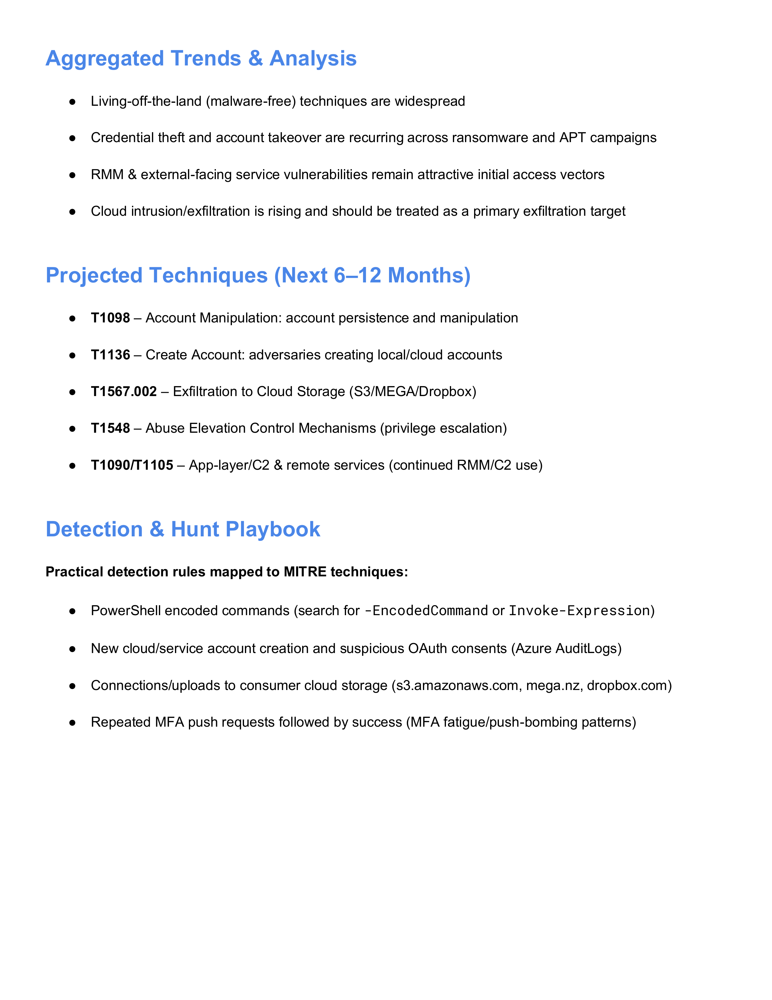
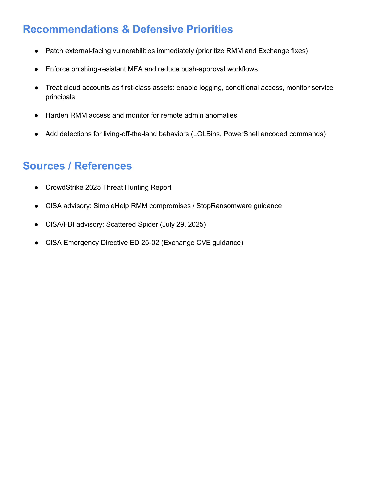
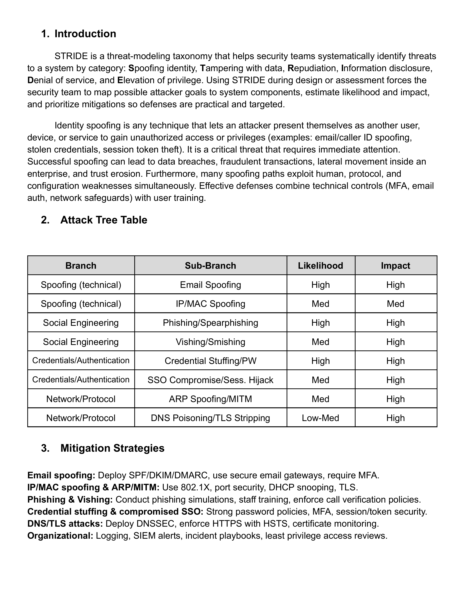

<h1>Threat Hunting and Incident Response</h1>

<h2>Description</h2>

This project demonstrates hands-on threat hunting, vulnerability discovery, and incident response analysis conducted within a controlled lab environment. The work combines technical reconnaissance, vulnerability research, MITRE ATT&CK–driven threat intelligence, and STRIDE threat modeling to mirror real-world SOC and IR workflows.

Key objectives include:

- Network reconnaissance and service enumeration
- Vulnerability identification and CVE analysis
- Threat hunting using MITRE ATT&CK
- Threat modeling using STRIDE
- Detection logic and defensive prioritization
- Professional documentation and reporting

---

<h2>Languages, Tools, and Frameworks</h2>

- <b>Kali Linux</b>
- <b>Nmap</b>
- <b>Searchsploit / Exploit-DB</b>
- <b>MITRE ATT&CK Framework</b>
- <b>STRIDE Threat Modeling</b>

---

<h2>Environments Used</h2>

- <b>Proxmox Virtual Environment</b>
- <b>Kali Linux</b>
- External lab-safe targets:
  - scanme.nmap.org
  - testphp.vulnweb.com

---

<h2>Program Walk-through</h2>

<b>Service version detection against an external host (scanme.nmap.org)</b> 

- Conducted Nmap service version detection
- Identified exposed services and software versions
- Confirmed OpenSSH and Apache versions
- Observed filtered and open ports

---

<b>TCP SYN scan against testphp.vulnweb.com</b>

- Conducted TCP SYN scan using Nmap
- Identified open and filtered TCP ports
- Confirmed Cisco-SCCP service on port 2000
- Observed a large number of filtered (no-response) ports
- Evaluated the externally exposed attack surface

---

<b>CVE severity and business impact analysis</b> 

- Evaluated CVE-2014-0226
- Assessed technical risk and operational impact
- Translated technical findings into business-focused risk language
- Identified Apache httpd version <b>2.4.7</b> during service enumeration
- Researched publicly known vulnerabilities associated with the identified version
- Leveraged Exploit-DB / Searchsploit references to identify relevant exploits
- Mapped the selected exploit to a corresponding CVE
- Validated vulnerability details using public CVE databases (MITRE CVE / NVD)

---

<h2>Reconnaissance & Enumeration Findings</h2>

<b>scanme.nmap.org</b>

- OpenSSH version: <b>6.6.1p1 Ubuntu 2ubuntu2.13</b>
- Apache version: <b>2.4.7</b>
- Port 445 state: <b>Filtered</b>
- Additional exposed ports:
  - 22 (SSH)
  - 53 (DNS)
  - 80 (HTTP)
  - 2000, 5060, 9929, 31337

<b>testphp.vulnweb.com</b>

- Open ports: <b>5</b>
- Filtered TCP ports (no response): <b>994</b>
- Cisco-SCCP service: <b>Port 2000</b>

---

<h2>Vulnerability Analysis</h2>

<b>CVE-2014-0226 — Apache HTTP Server 2.4.7</b>

- Severity: <b>Medium (CVSS 6.4–6.8)</b>
- Vulnerability type: Race condition in mod_status scoreboard handling
- Potential impacts:
  - Denial of service via worker process crashes
  - Information disclosure
  - Possible remote code execution in certain configurations

<h3>Business Impact</h3>

- Disruption of customer-facing or internal services
- Increased operational downtime and recovery costs
- Loss of customer trust and reputational damage
- Potential regulatory exposure if sensitive data is compromised

---

<h2>MITRE-Driven Threat Hunting</h2>

<b>MITRE ATT&CK threat hunting summary and observed trends</b> 

- Analyzed real-world threat intelligence reports from CrowdStrike and CISA
- Identified growth in malware-free and living-off-the-land techniques
- Observed increasing focus on identity and cloud environments

<b>Observed adversary techniques mapped to MITRE ATT&CK</b> 

- T1059 – Command and scripting (PowerShell)
- T1218 – Signed binary proxy execution (LOLBins)
- T1078 – Valid accounts
- T1566 – Phishing
- T1486 – Ransomware encryption
- T1567 – Exfiltration to cloud services

<b>Aggregated trends and projected attacker behavior</b> 

- Credential theft and account manipulation remain dominant access vectors
- RMM tools and exposed services are frequent initial access points
- Cloud platforms are increasingly used for data exfiltration

---

<h2>Detection & Hunt Playbook</h2>

- Detect PowerShell abuse:
  - `-EncodedCommand`
  - `Invoke-Expression`
- Monitor cloud logs for:
  - New account creation
  - Suspicious OAuth consent grants
- Alert on uploads to consumer cloud storage:
  - S3
  - Dropbox
  - MEGA
- Identify MFA fatigue patterns:
  - Repeated push requests followed by success

---

<h2>STRIDE Threat Modeling</h2>

<b>Identity spoofing attack tree and mitigation mapping</b> 

- Applied STRIDE methodology to analyze identity spoofing threats
- Evaluated likelihood and impact of social engineering and credential abuse
- Identified layered mitigations including MFA, logging, and access controls

---

<h2>Recommendations & Defensive Priorities</h2>

- Patch external-facing services immediately
- Harden and monitor RMM access
- Enforce phishing-resistant MFA
- Treat cloud identities as first-class assets
- Expand detections for LOLBins and credential abuse

---

<h2>Skills Demonstrated</h2>

- Threat hunting and reconnaissance
- Vulnerability discovery and CVE analysis
- MITRE ATT&CK mapping
- STRIDE threat modeling
- SOC-style reporting
- Business risk communication
