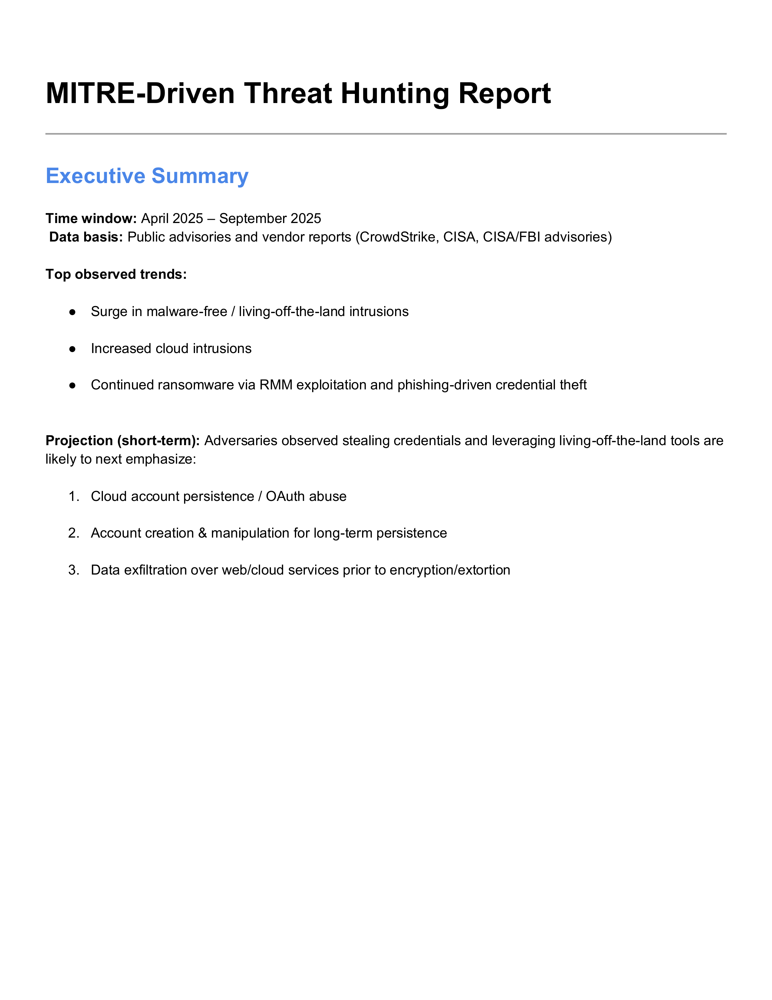
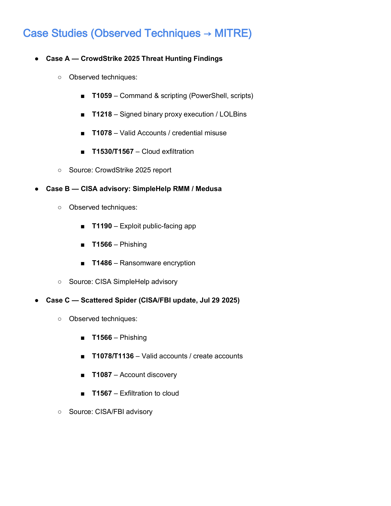
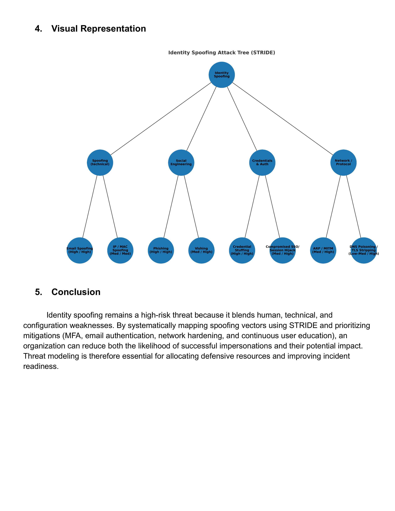

<h1>Threat Hunting and Incident Response</h1>

<h2>Description</h2>

This project demonstrates hands-on threat hunting, vulnerability discovery, and incident response analysis conducted within a controlled lab environment. The work combines technical reconnaissance, vulnerability research, MITRE ATT&CK–driven threat intelligence, and business impact assessment to mirror real-world SOC and IR workflows.

Key objectives include:

- Network reconnaissance and service enumeration
- Vulnerability identification and CVE analysis
- Threat hunting using MITRE ATT&CK
- Detection logic and defensive prioritization
- Professional documentation and reporting

---

<h2>Languages, Tools, and Frameworks</h2>

- <b>Kali Linux</b>
- <b>Nmap</b>
- <b>Searchsploit (Exploit-DB)</b>
- <b>MITRE ATT&CK Framework</b>
- <b>STRIDE Threat Modeling</b>

---

<h2>Environments Used</h2>

- <b>Proxmox Virtual Environment</b>
- <b>Kali Linux</b>
- External lab-safe targets:
  - scanme.nmap.org
  - testphp.vulnweb.com

---

<h2>Program Walk-through</h2>

<b>Service version detection against an external host (scanme.nmap.org)</b> 

- Conducted Nmap service version detection
- Identified exposed services and software versions
- Confirmed OpenSSH and Apache versions
- Observed filtered and open ports

---

<b>TCP SYN scan against testphp.vulnweb.com</b> 

- Identified open and filtered TCP ports
- Confirmed Cisco-SCCP service on port 2000
- Observed large number of filtered (no-response) ports
- Evaluated exposed attack surface

---

<b>Vulnerability research using Searchsploit</b> 

- Located Apache httpd version 2.4.7
- Queried Searchsploit for known vulnerabilities
- Selected a documented exploit for analysis
- Tracked vulnerability to public CVE databases

---

<b>CVE severity and business impact analysis</b> 

- Evaluated CVE-2014-0226
- Assessed technical risk and operational impact
- Translated technical findings into business language

---

<h2>Reconnaissance & Enumeration Findings</h2>

<b>scanme.nmap.org</b>

- OpenSSH version: <b>6.6.1p1 Ubuntu 2ubuntu2.13</b>
- Apache version: <b>2.4.7</b>
- Port 445 state: <b>Filtered</b>
- Additional exposed ports:
  - 22 (SSH)
  - 53 (DNS)
  - 80 (HTTP)
  - 2000, 5060, 9929, 31337

<b>testphp.vulnweb.com</b>

- Open ports: <b>5</b>
- Filtered TCP ports (no response): <b>994</b>
- Cisco-SCCP service: <b>Port 2000</b>

---

<h2>Vulnerability Analysis</h2>

<b>CVE-2014-0226 — Apache HTTP Server 2.4.7</b>

- Severity: <b>Medium (CVSS 6.4–6.8)</b>
- Vulnerability type: Race condition in mod_status scoreboard handling
- Potential impacts:
  - Denial of service via worker process crashes
  - Information disclosure
  - Possible remote code execution in certain configurations

<h3>Business Impact</h3>

- Disruption of customer-facing or internal services
- Increased operational downtime and recovery costs
- Loss of customer trust and reputational damage
- Potential regulatory exposure if sensitive data is compromised

---

<h2>MITRE-Driven Threat Hunting</h2>

<b>MITRE ATT&CK threat hunting analysis and case studies</b> 

<h3>Observed Adversary Techniques</h3>

<b>CrowdStrike 2025 Findings</b>
- T1059 – Command and scripting (PowerShell)
- T1218 – Signed binary proxy execution (LOLBins)
- T1078 – Valid accounts
- T1530 / T1567 – Cloud data exfiltration

<b>CISA SimpleHelp RMM / Medusa</b>
- T1190 – Exploit public-facing application
- T1566 – Phishing
- T1486 – Ransomware encryption

<b>Scattered Spider (CISA/FBI)</b>
- T1566 – Phishing
- T1078 / T1136 – Valid and newly created accounts
- T1087 – Account discovery
- T1567 – Cloud exfiltration

---

<h2>Aggregated Threat Trends</h2>

- Living-off-the-land (malware-free) techniques are increasing
- Credential theft remains a dominant initial access vector
- RMM tools and exposed services are high-value targets
- Cloud platforms are increasingly used for exfiltration

---

<h2>Projected Techniques (6–12 Months)</h2>

- T1098 – Account manipulation and persistence
- T1136 – Account creation (local and cloud)
- T1567.002 – Exfiltration to cloud storage
- T1548 – Abuse elevation control mechanisms
- T1090 / T1105 – Application-layer command and control

---

<h2>Detection & Hunt Playbook</h2>

- Detect PowerShell abuse:
  - `-EncodedCommand`
  - `Invoke-Expression`
- Monitor cloud logs for:
  - New account creation
  - Suspicious OAuth consent grants
- Alert on uploads to consumer cloud storage:
  - S3
  - Dropbox
  - MEGA
- Identify MFA fatigue patterns:
  - Repeated push requests followed by success

---

<h2>STRIDE Threat Modeling</h2>

<b>Identity spoofing attack tree and mitigation mapping</b> 

- Applied STRIDE methodology to identity spoofing
- Mapped likelihood vs impact
- Identified layered technical and organizational mitigations

---

<h2>Recommendations & Defensive Priorities</h2>

- Patch external-facing services immediately
- Harden and monitor RMM access
- Enforce phishing-resistant MFA
- Treat cloud identities as first-class assets
- Expand detections for LOLBins and credential abuse

---

<h2>Skills Demonstrated</h2>

- Threat hunting and reconnaissance
- Vulnerability discovery and CVE analysis
- MITRE ATT&CK mapping
- STRIDE threat modeling
- SOC-style reporting
- Business risk communication
